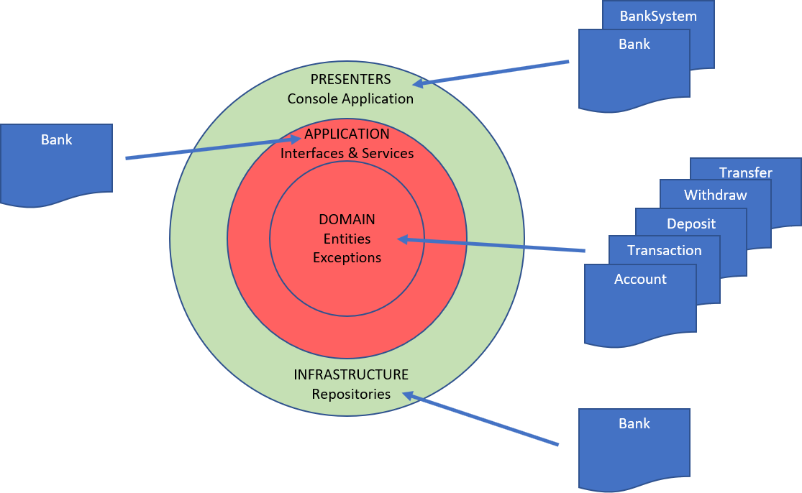

# Clean Architecture Version of the Base Application

This repository contains a reorganisation of the base banking application following a simple approach to a Clean Architecture.

## Main Reorganisation

The previous Bank class has been divided into several classes and also taken on almost all of the code previously in the BankSystem. These classes for the main classes of the CLI application.

Meanwhile, the Bank class previously contained the in-memory Lists to store accounts and transactions. These have been moved into the Infrastructure project as in-memory repositories and support equivalent services located in the Core.

The domain entities of the application, representintg the Account and transaction classes are moved into the Core application.

Overall organisation of the code can be represented at a high-level as:



## Installation

```git clone https://github.com/pscompsci/ApplicationArchitecture.git```

## Running the Application

Set CleanBankingApp.Cli at the Startup Project in Visual Studio

In the command line:

```cd 02_CleanArchitecture/src/CleanBankingApp.cli
   dotnet run```

## Tests

Xunit tests are located in the test directory.