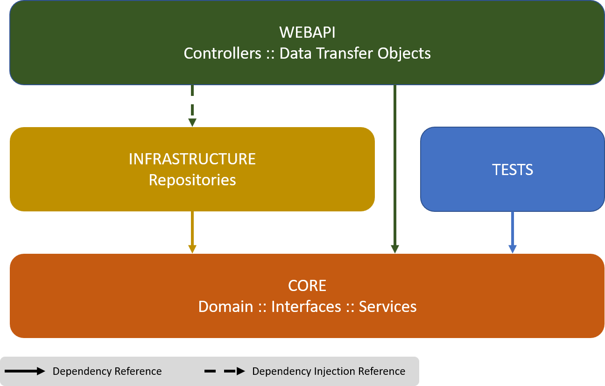

# Clean Architecture Version of the Base Application

This repository extends the 02_CleanBankingApp repository by replacing the previous console application with a simple WebAPI.


## Main Reorganisation

This shows one of the strengths of the clean architecture, in that, to change the User Interface, only he startup project needs to change. 

Since the Core and Infrastructure are decoupled from the UI, switching out components is simple.

Additionally, while this repository no longer contains the prvious CLI, it is completely possible to have both the WebAPI and CLI alongside
each other and to start and use both interfaces with the same Core and Infrastrcture (noting that each application will use it's own repository
instance, so data is not shared between the projects in this way).

The WebAPI provides RESTful endpoints and utilises HTTP/JSON for restful communication.

Overall organisation of the code can be represented at a high-level as:



## Installation

```git clone https://github.com/pscompsci/ApplicationArchitecture.git```

## Running the Application

Set CleanBankingApp.WebApi at the Startup Project in Visual Studio

In the command line:

```
cd 02_CleanArchitecture/src/CleanBankingApp.cli
dotnet run
```

## Tests

The previous Unit tests have been removed for simplicity, however the test folder contains to .http files to manually run http requests.

In Visual Studio Code, the Rest Client provides a convenient alternative to other clients such as Postman. For Visual Studio, Postman has been
utilised as the standard way to interact with the API.

## Links for Extensions and External Tools

If using Visual Studio:  
[Postman](https://www.postman.com/)

If using Visual Studio Code:  
[REST Client](https://marketplace.visualstudio.com/items?itemName=humao.rest-client)